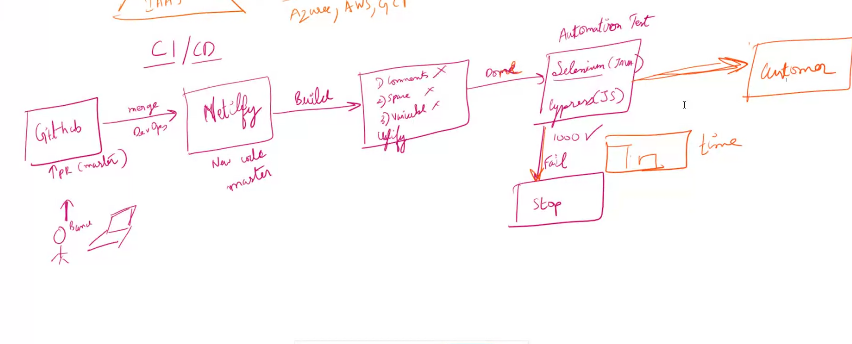

## ahead and behind

### behind
 - no of commits made in the main branch which are not in the existing branch
 - there is no need of merging in case of behind as commits are made in main branch,fast forward takes place

 ### ahead
 - no of commits made in sub branch which are not present in main branch
 - there is need of merging in case of ahead to commit the changes in main branch 
------------------------------------------------------------------------------------------------------------
 
 ### DAY8

- revert is used to change the commits
- edit can change the commits made in a particular commit which is more powerful
- rebase is used to maintain the history in a same line(straight line)
- rebase-straight line-easy to find bugs-(git biscet) is used
 -----------------------------------------------------------------------------------------------------------
 
## Key Terms
1. Configuration Management
    CI(configuration item)-it deals with git files
    - audit is used for checking(which code is causing issues),for better resolving
      - <b>commits</b>-sign
      - <b>gitblame</b>-to findout whats going wrong(to find bugs)

2.Release Management-Branhing strategy-master,staging,dev
    - CI/CD(Continuous integration)(Continuous   deployment)-netlify 

-  CI(configuration item)-it deals with git files
- git log,git blame is ued to find who did what
- base line:it is the checkpoint in a system,if smtg falls ,we can resume
  1. commits
  2. tags(all the versions)-->just to keep it simple.
-accounting-to know who did what
- change management-how efficient to bring about a change,the process of bringing change in a system,it is maintained through changes and creating prs(pull requests)

## Benefits of maintaining configuration management
1. traceability-who?why?
2. quality and consistency(is maintained through prs)
3. backup-reduces risks of loosing data
4. change management 

### Release Management

.png>)

- In agile,release takes place after 2 sprints
1. Planning-proper plan (monthly once-customer,every 2 weeks-QA)
2. Governance-access level of each branch
3. Scheduling-maintained through sprints and agile process from pointg to point
4. Automation-achieved through CI/CD ,reducing the human errors
5. Contigency-refers to backup-we can rollback to older versions if any bug occurs and need to be solved immediately

-------------------------------------------------

- IAAS-Infrastructure as a service-building own appplications-they provide pcs which can be used accoring to our requirements(build home),ex-azure,aws,we need to install all the requirements
- PAAS- Platform as a service-to build applications-all the installements are done by default,just we need to put the code(renting a home,but not furnished(with environment prsent)),they will automatically scale,ex-railway.app,render.com(free),netlify,vercel
-used by startups,freelancers
release management is paas
- SAAS- Software as a service-everything is present,can be used according to requirements,ex-swiggy,netflix,google drive
---------------------------------------------
- jenkin is btwn iaas and paas
- jenkin can be hosted internally(availability can be made internally)
---------------------------------------------
## CI/CD Process

## Use of Uglification

- dowloading can be easy as the files become smaller.
- it removes some of the code which is not useful
- until netlify is called CI
- from netlify to customer,it is called CD