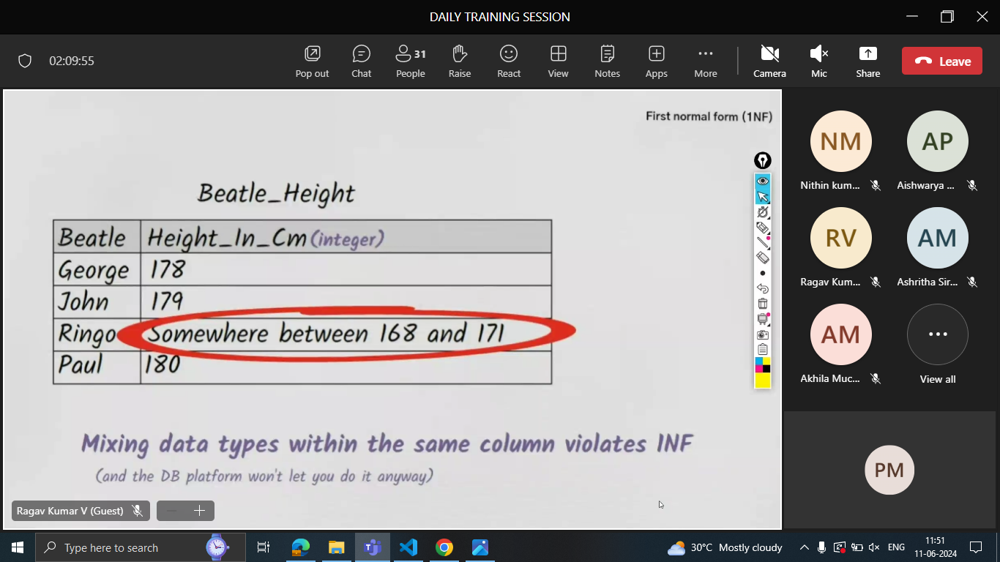

## SQL

- It is a special software to store data

-The database lives in Cloud(cloud is renting PC'S)
- There are different cloud storage providers
   - aws,azure,google cloud platform,ibm cloud,alibaba cloud,salesforce
-google drive is not cloud bcz installations cannot be done
-------------------------------------------
- aws is ahead of all by 33% as they are first to start(their first in was netflix),next is azure

## If buying own PC?
1.High cost
2.Rent room
3.A/C-power bill
4.Maintenance(swaps harddisks)
5.spares(hardidisks,ram)
6.Need of generator -to run 24/7

- If not buying and renting,it is the responsible of azure,aws to manage above all.

## Disaster Management-adv of renting pc

- should be placed in a non-prone areas of attack
- some disasters cannot be avoided,a backup is needed(disaster recovery plan) which is provided by disaster management
 

## How to rent PC?

.png>)

1.choosing
2.installing os
  - what os in cloud?-linux

# Advgs of Linux

1. free
2. open-source
3. secure
4. smaller footprint(pay as u go model-it takes less moeny when compared to windows )
5. automation-everything can be done from terminal
-------------------------------------------------------
- linux has flavors like fedora,tails;windows has versions
- flavors are called distros
- distros or distribution: we are using alpine which is pf 256mb

------------------------
## Scaling

-adding more cpus to prevent server down issues
1. <b>Vertical</b> scaling-upgrading or replacing RAM or processor thus making system powerful
2. <b>Horizantal</b>-adding more and more pcs

- Choice of choosing which type of scaling is based on the cost i.e cheaperness

## Autoscaling

- Pay as u go model(pay as much reqired)
 when load becomes 80% in ur system,will add more pcs to distribute the load                      
 

How to identify the attacking bots?
 
1. Finding the patterns of the attackers and finding the bots
2. Restricting the unrelated IP addresses.
3.By using captcha
4.Diverting the traffic
-------------------------------------------------
- RAM is 10,000 times faster than harddisk.
-If the data is kept in RAM,if the system crashes all the data is gone
-Harddisk is a permanent storage area
-RAM is a temporary storage area
- SSD is 10 times faster than harddisk
-------------------------------------------
## Y Database?  

- When data is frequently asked, a copy of it is stored.If we ask for retrieval the data
is first checked in RAM,if not present then it is checked in Harddisk.Below image explains-

---------------------------
## Features of Database

1. When frequently asked,data is stored in RAM
2. Querying becomes easy
3. CRUD becomes easy
4. Backups are inbuilt
5. Undo-easily(time limit)
6. Performance
------------------------------------------------
## SQL vs NOSQL
- In SQL,data is stored in tables
- In NOSQL data is stored in documents
## Relational Databases(SQL)
- The below are diff examples

## NOSQL

- redis can be used for faster retrieval as data is stored in RAM.
------------------------------------------------
# JUN 11

## Y we need joins?

- without joins,will have storage issues
- with joins-
   1. storage issues can be avoided
   2. anamolies can be avoided
- to connect 2 tables we use <b>injuction/mapping table</b>

## Primary Key
1. should be unique
2. should not be null
3. only 1 primary key per table

## Foreign key
- it is used to join 2 tables
- refers to primary key in other table
----------------------------------------------
- after separation of tables,tables are normalized
- before denormalized

## Normalization
  - ### Y we need?
    - removes redundant data
    - data can be safe

## 1NF

.png>)

.png>)

- Composite Primary Key-combination of two columns being primary key

### 2NF

- Insertion,updation,deletion anamolies occurs
- Non-key attributes are the ones which are not either primary or composite
- Each non-key attribute should be depend on the entire primary key

