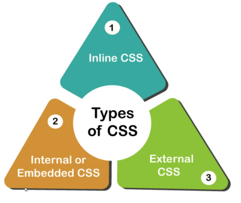
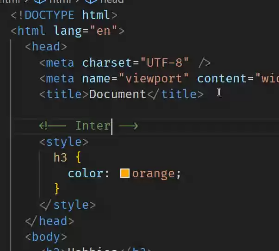
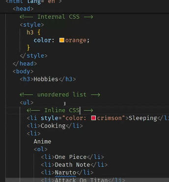
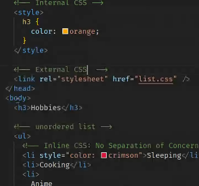

- lorem
  -creates random words
- lorem100-creates 100 words randomly
- target blank
  - automatically opens in new tab
- anchor tag 
  - to give links,phn numbers,mails
  tel,mailto

## Types of css

### Internal CSS(when single http request is needed)

### Inline CSS-(there will be no separation of concern)

### External CSS

- It is good to use external,preferred for larger projects
- external is sometimes more preferred as to link to more html files

## CSS TERMINOLOGY

### Text Styling
1. font-weight -thickness
2. font-style-italic,bold
3. font-family-(diff styles like times new roman,calbri)
4. font size
5. color 
--------------------------------------------------
- font-weight=normal==>makes it unbold
- font-weight=bold==>makes it unbold
-------------------------------------------------
- color wheel -0 to 255
------------------------------------------------
- Before HSL (Hue, Saturation, and Lightness) were used,as supported by many applications.
- To get more colors,now LCH stands for Lightness, Chroma, and Hue are used(larger color gamette like srgb,dcpi);Rightnow srgb is suoorted by LCH
-----------------------------------------------------------
## Text Styling
 

1. text transform-upper,lower,capitalize
2. text-align-->centre,bottom,top
3.text decoration
4.letter spacing-to give posh looking
5.line-height--->distance between the lines
  when font size is smaller,line height should be more and vice versa

--------------------------------------------------

revert-undo the mistake 
reset-delete the mistake
hard-entire commit will be deleted 
soft-deletes the commit but allows to edit particular commit
----------------------------------------------

1vh=1% of screen height
1vw=1% of screen width
width=1%of container width