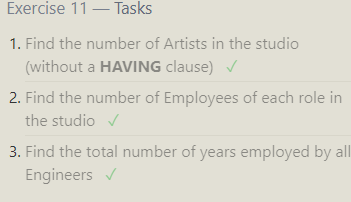

Exercise 1 — Tasks
1. Find the title of each film ✓
     ```sql
     SELECT title FROM movies;
     ```
2. Find the director of each film
   ```sql
      SELECT director FROM movies;
    ```
3. Find the title and director of each film
    ```sql
    SELECT title,director FROM movies;
    ```

4.Find the title and year of each film
  ```sql
  SELECT title,year FROM movies;
  ```

5.Find all the information about each film
  ```sql
  SELECT * FROM movies;
  ```


------------------------------
Exercise 2 — Tasks
1. Find the movie with a row id of 6 ✓
2. Find the movies released in the years between 2000 and 2010 ✓
3. Find the movies not released in the years between 2000 and 2010 ✓
4. Find the first 5 Pixar movies and their release year

1.
```sql
SELECT title FROM movies
Where id=6;
```
2.
```sql
SELECT title FROM movies
Where year BETWEEN 2000 AND 2010;
```
3.
```sql
SELECT title FROM movies
Where year NOT BETWEEN 2000 AND 2010;
```
4.
```sql
SELECT title,year FROM movies
Where id BETWEEN 1 AND 5;
```


--------------------------------------
Exercise 3 — Tasks
Find all the Toy Story movies ✓
Find all the movies directed by John Lasseter
Find all the movies (and director) not directed by John Lasseter
Find all the WALL-* movies

1.
```sql
SELECT title FROM Movies
Where title LIKE "%Toy%";
```
2.
```sql
SELECT title FROM Movies
Where Director="John Lasseter";
```
3.
```sql
SELECT title,Director FROM Movies
Where Director!="John Lasseter";
```
4.
```sql
SELECT title FROM Movies
Where title LIKE "%Wall%";
```

-----------------------------------------
Exercise 4 — Tasks
1. List all directors of Pixar movies (alphabetically), without duplicates 
1.
```sql
SELECT DISTINCT Director FROM movies
ORDER BY Director ASC;
```
2. List the last four Pixar movies released (ordered from most recent to least)
2.
```sql
SELECT title FROM movies
ORDER BY year DESC limit 4;
```
3. List the first five Pixar movies sorted alphabetically
3.
```sql
SELECT title FROM movies
ORDER BY title limit 5;
```
4. List the next five Pixar movies sorted alphabetically
4.
```sql
SELECT title FROM movies
ORDER BY title ASC
limit 5 offset 5;
```


-----------------------------------
Review 1 — Tasks
1.List all the Canadian cities and their populations 
 ```sql
    SELECT city,population FROM north_american_cities where country="Canada";
```
2.Order all the cities in the United States by their latitude from north to south
  ```sql
SELECT city FROM north_american_cities
where country="United States"
order by latitude desc;
```

3.List all the cities west of Chicago, ordered from west to east
```sql
SELECT city FROM north_american_cities
where longitude<(select longitude from north_american_cities where city="Chicago")
order by longitude;
```

4.List the two largest cities in Mexico (by population)
```sql
SELECT city FROM north_american_cities
where country="Mexico"
order by population desc limit 2;
```
5.List the third and fourth largest cities (by population) in the United States and their population
```sql
SELECT city,population FROM north_american_cities
where country="United States"
order by population desc limit 2 offset 2;
```


-------------------------------

Exercise 6 — Tasks
1.Find the domestic and international sales for each movie 
```sql
select title,Domestic_sales,International_sales from Boxoffice
join Movies
where Movies.Id=Boxoffice.Movie_id;
```
2.Show the sales numbers for each movie that did better internationally rather than domestically
```sql
select title,Domestic_sales,International_sales from Boxoffice
join Movies on Movies.Id=Boxoffice.Movie_id
where Boxoffice.International_sales>Boxoffice.Domestic_sales;
```

3.List all the movies by their ratings in descending order
```sql 
select title from Boxoffice
join Movies on Movies.Id=Boxoffice.Movie_id
order by rating desc;
```

-----------------------------------------------
Exercise 7 — Tasks
1. Find the list of all buildings that have employees 
   ```sql
   SELECT DISTINCT building_name FROM buildings inner join employees on buildings.building_name=employees.building;
    ```
2.Find the list of all buildings and their capacity
```sql
SELECT distinct building_name,capacity FROM buildings
left join employees
on buildings.building_name=employees.building;
```

3.List all buildings and the distinct employee roles in each building (including empty buildings)
```sql
select distinct building_name,role from buildings
left join employees
on buildings.building_name=employees.building;
```


---------------------------------------------
Exercise 8 — Tasks
1.Find the name and role of all employees who have not been assigned to a building 
```sql
SELECT name,role FROM employees
where building is null;
```

2.Find the names of the buildings that hold no employees
```sql
SELECT distinct building_name FROM buildings
left join employees
on buildings.building_name=employees.building
where building is null;
```
-------------------------------------------------------

Exercise 9 — Tasks
1.List all movies and their combined sales in millions of dollars 
```sql
select title,(domestic_sales+international_sales)/1000000
as new from boxoffice
left join movies
on boxoffice.movie_id=movies.id;
```
2.List all movies and their ratings in percent
```sql
select title,ROUND(rating/10*100)
from boxoffice
left join movies
on boxoffice.movie_id=movies.id;
```
3.List all movies that were released on even number years
```sql 
select title from movies
where movies.year%2==0;
```


--------------------------------------------
Exercise 10 — Tasks
1.Find the longest time that an employee has been at the studio 
```sql 
SELECT name,max(years_employed) from employees;
```
2.For each role, find the average number of years employed by employees in that role
```sql
SELECT role,avg(years_employed) from employees
group by role;
```
3.Find the total number of employee years worked in each building
```sql
SELECT building,sum(years_employed) from employees
group by building;
```
-----------------------------------------
Exercise 11 — Tasks
1.Find the number of Artists in the studio (without a HAVING clause) 
```sql
SELECT count(role) from employees
where role="Artist";
```
2.Find the number of Employees of each role in the studio
```sql
select role,count(role) from employees
group by role;
```
3.Find the total number of years employed by all Engineers
```sql
select sum(Years_employed) from Employees
where role="Engineer";
```

---

Exercise 12 — Tasks
1.
Find the number of movies each director has directed ```sql
SELECT Director,count(Title) FROM Movies
group by director;
```
2.Find the total domestic and international sales that can be attributed to each director
```sql 
SELECT director,sum(Domestic_sales+International_sales) FROM movies
inner join boxoffice
on movies.id=boxoffice.movie_id
group by director;
```
