**Database Tables:**

1. **Customers:**

   - `customer_id` (Primary Key)
   - `first_name`
   - `last_name`
   - `DOB` (Date of Birth)
   - `email`
   - `phone_number`
   - `address`

2. **Accounts:**

   - `account_id` (Primary Key)
   - `customer_id` (Foreign Key)
   - `account_type` (e.g., savings, current, zero_balance)
   - `balance`

3. **Transactions:**

   - `transaction_id` (Primary Key)
   - `account_id` (Foreign Key)
   - `transaction_type` (e.g., deposit, withdrawal, transfer)
   - `amount`
   - `transaction_date`

4. **InterestRates:**

   - `interest_rate_id` (Primary Key)
   - `account_type` (e.g., savings, current)
   - `interest_rate`

5. **Branches:**
   - `branch_id` (Primary Key)
   - `branch_name`
   - `address`

**Questions:**

1. Insert at least 10 sample records into each of the following tables: `Customers`, `Accounts`, `Transactions`, `InterestRates`, `Branches`.
---------------------
## Customer Table
```sql
drop table Customers;
CREATE TABLE Customers (
    customer_id INT PRIMARY KEY,
    first_name VARCHAR(150) ,
    last_name VARCHAR(120) ,
    DOB date,
	email VARCHAR(70),
	phone_number BIGINT,
	address VARCHAR(150)
);
INSERT INTO Customers (customer_id, first_name, last_name, DOB, email, phone_number, address)
VALUES
    (1, 'John', 'Doe', '1990-05-15', 'john.doe@example.com', '1234567890', 'USA'),
    (2, 'Jane', 'Smith', '1985-08-20', 'jane.smith@example.com', '3267459112', 'Canada'),
    (3, 'Michael', 'Johnson', '1988-11-10', 'michael.johnson@example.com', '5551234567', 'Australia'),
    (4, 'Emily', 'Brown', '1992-03-25', 'emily.brown@example.com', '1112223333', 'Germany'),
    (5, 'William', 'Davis', '1987-09-05', 'william.davis@example.com', '9998887777', 'Japan'),
    (6, 'Sarah', 'Wilson', '1991-06-30', 'sarah.wilson@example.com', '4445556666', 'Brazil'),
    (7, 'James', 'Martinez', '1989-02-18', 'james.martinez@example.com', '7778889999', 'France'),
    (8, 'Anna', 'Garcia', '1993-07-12', 'anna.garcia@example.com', '2223334444', 'Africa'),
    (9, 'David', 'Lopez', '1990-12-08', 'david.lopez@example.com', '6667778888', 'India'),
    (10, 'Olivia', 'Harris', '1986-04-22', 'olivia.harris@example.com', '3334445555', 'Mexico');
SELECT * from Customers;
```

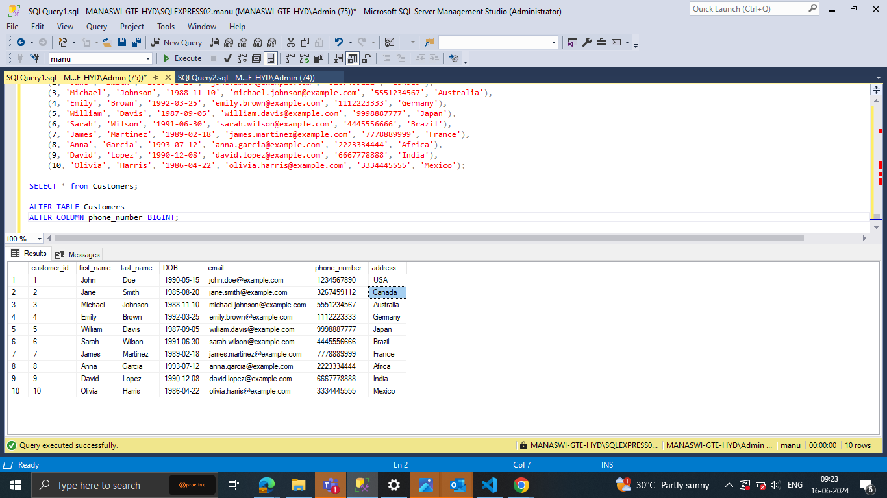
-------------
## Accounts Table
```sql

CREATE TABLE Accounts (
    account_id INT PRIMARY KEY,
    customer_id INT,
    account_type VARCHAR(50),
    balance INT,
);

INSERT INTO Accounts (account_id, customer_id, account_type, balance)
VALUES
    (101, 1, 'savings', 5000),
    (102, 2, 'current', 10000),
    (103, 3, 'savings', 7500),
    (104, 4, 'current', 12000),
    (105, 5, 'zero_balance', 0),
    (106, 6, 'savings', 3000),
    (107, 7, 'current', 8000),
    (108, 8, 'current', 9500),
    (109, 9, 'savings', 6000),
    (110, 10, 'zero_balance', 0);
select * from Accounts;
```
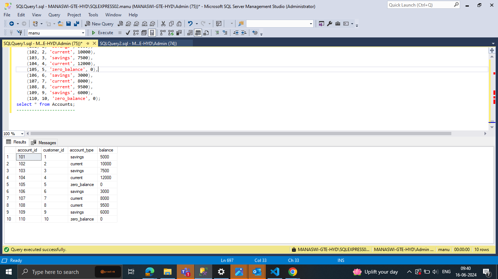
------------------
 ## Transactions table

```sql
CREATE TABLE Transactions (
    transaction_id INT PRIMARY KEY,
    account_id INT,
    transaction_type VARCHAR(50),
    amount INT,
    transaction_date DATE,
);
INSERT INTO Transactions (transaction_id, account_id, transaction_type, amount, transaction_date)
VALUES
    (1, 101, 'deposit', 1000, '2023-06-15'),
    (2, 102, 'withdrawal', 500, '2023-06-16'),
    (3, 103, 'deposit', 1500, '2023-06-17'),
    (4, 101, 'transfer', 200, '2023-06-18'),
    (5, 104, 'deposit', 3000, '2023-06-19'),
    (6, 102, 'withdrawal', 800, '2023-06-20'),
    (7, 105, 'deposit', 2500, '2023-06-21'),
    (8, 103, 'transfer', 300, '2023-06-22'),
    (9, 101, 'deposit', 1200, '2023-06-23'),
    (10, 104, 'withdrawal', 1000, '2023-06-24');
select * from Transactions;
```
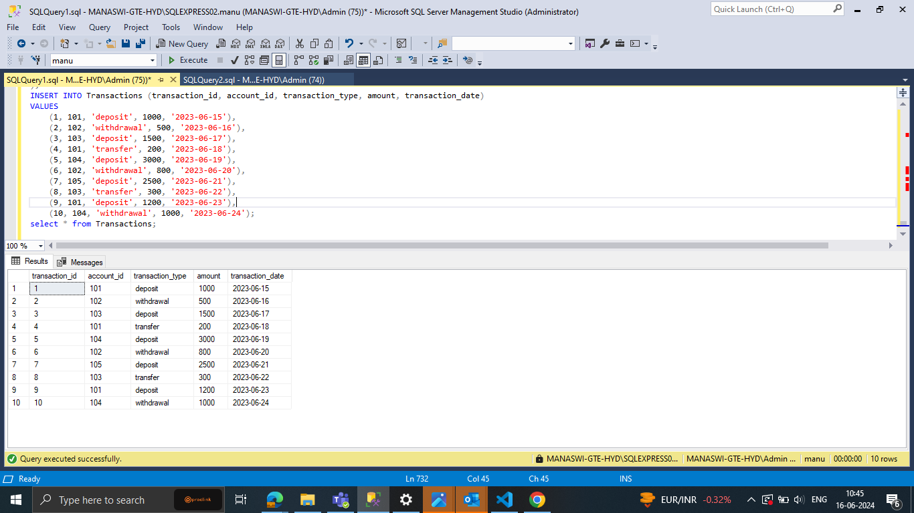
--------------------
## InterestRates Table
```sql
CREATE TABLE InterestRates (
    interest_rate_id INT PRIMARY KEY,
    account_type VARCHAR(50),
    interest_rate INT
);

INSERT INTO InterestRates (interest_rate_id, account_type, interest_rate)
VALUES
    (1, 'savings', 150),   
    (2, 'current', 50),    
    (3, 'savings', 175),  
    (4, 'current', 75),    
    (5, 'savings', 200),   
    (6, 'current', 100),   
    (7, 'savings', 225),   
    (8, 'current', 125),   
    (9, 'savings', 250),  
    (10, 'current', 150);  
select * from InterestRates;
```
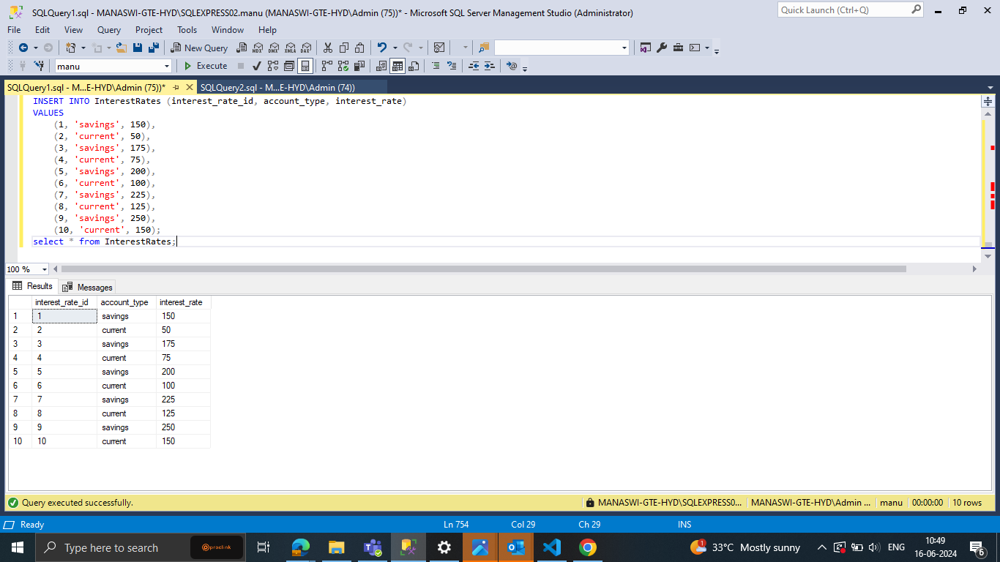
---------------------
## Branches Table
```sql
CREATE TABLE Branches (
    branch_id INT PRIMARY KEY,
    branch_name VARCHAR(100),
    address VARCHAR(150)
);

INSERT INTO Branches (branch_id, branch_name, address)
VALUES
    (1, 'Main Branch', '123 Main Street, City A'),
    (2, 'Downtown Branch', '456 Center Avenue, City B'),
    (3, 'Westside Branch', '789 West Boulevard, City C'),
    (4, 'North Branch', '101 North Street, City D'),
    (5, 'East Branch', '202 East Avenue, City E'),
    (6, 'South Branch', '303 South Boulevard, City F'),
    (7, 'Central Branch', '404 Central Street, City G'),
    (8, 'Uptown Branch', '505 Uptown Avenue, City H'),
    (9, 'Riverside Branch', '606 Riverside Boulevard, City I'),
    (10, 'Parkside Branch', '707 Parkside Street, City J');
select * from Branches;
```
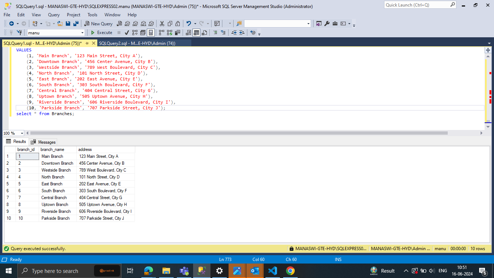 
-------------------
2. Write a SQL query to retrieve the name, account type, and email of all customers.
```sql
select concat(first_name,last_name) as name,account_type,email 
from Customers
inner join Accounts
on Customers.customer_id=Accounts.customer_id;
```
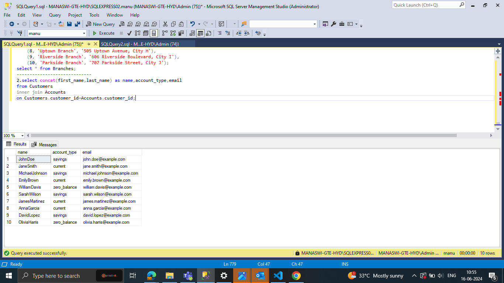

3. Write a SQL query to list all transactions along with the corresponding customer.
```sql
select  concat(first_name,last_name) as fullname,transaction_id,account_id,transaction_type,amount,transaction_date
from Transactions
join Customers
on Transactions.transaction_id=Customers.customer_id;
```
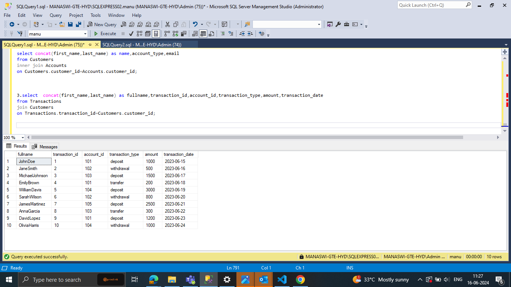

4. Write a SQL query to increase the balance of a specific account by a certain amount.
```sql
UPDATE Accounts
SET balance = balance + 3000
WHERE account_id = 103;

select * from Accounts;
```

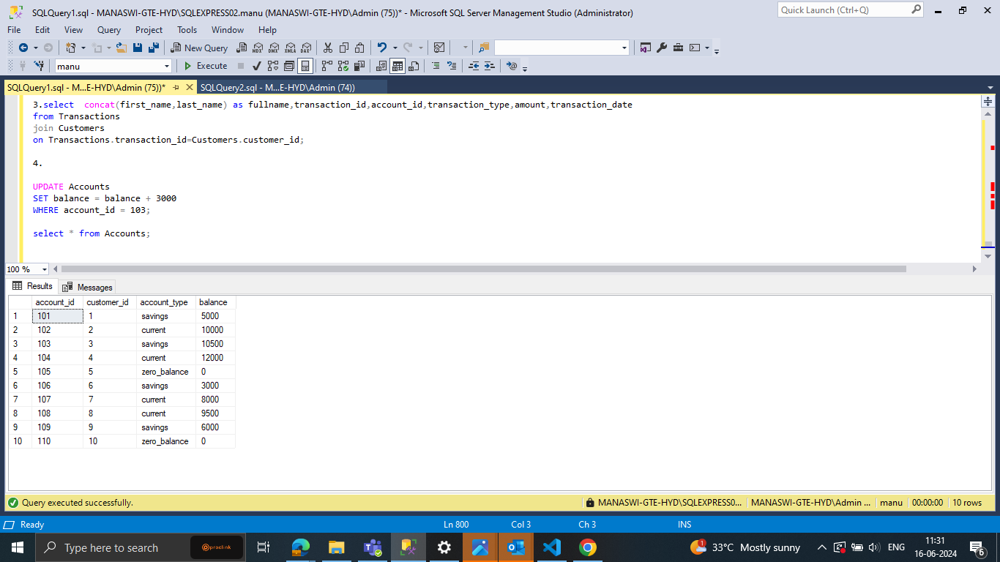 
--------------------------

5. Write a SQL query to combine the first and last names of customers as `full_name`.
```sql 
select first_name,last_name,concat(first_name,last_name) as full_name 
from Customers;
```
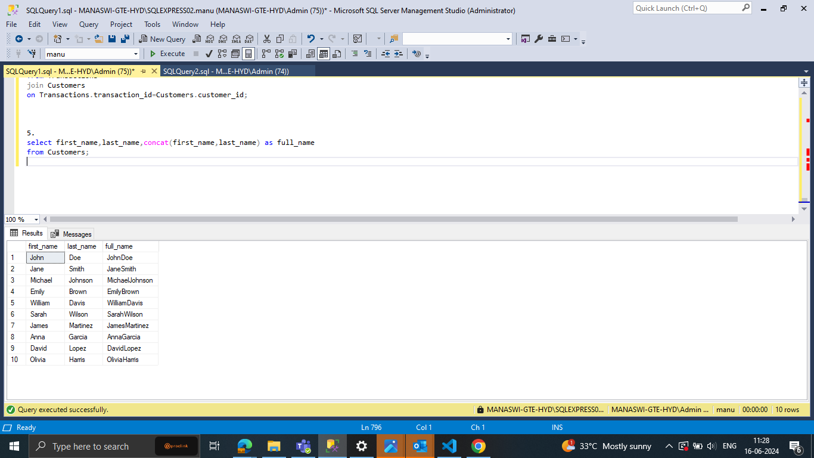
------------------------------
6. Write a SQL query to remove accounts with a balance of zero where the account type is savings.

```sql
delete from AccountsNEW 
where balance=0 and account_type='savings';
```
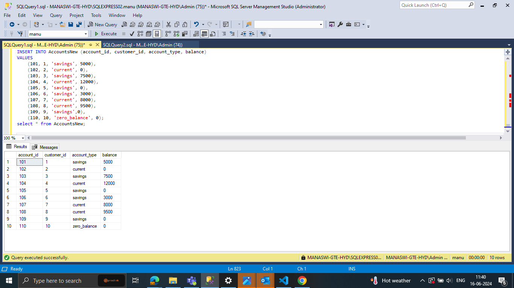
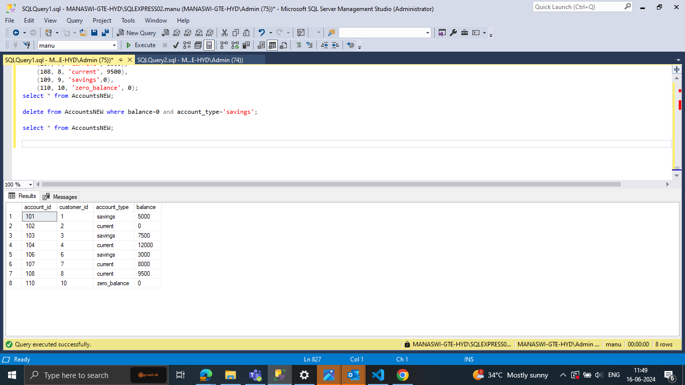
-----------------------------
7. Write a SQL query to find customers living in a specific city.
```sql
SELECT concat(first_name,last_name) as full_name,city from CustomersNEWWW 
where city='USA' or city='Canada';
```
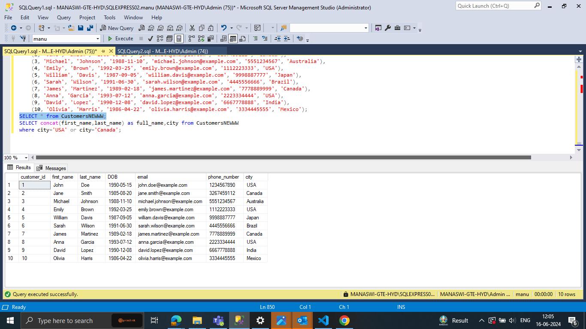
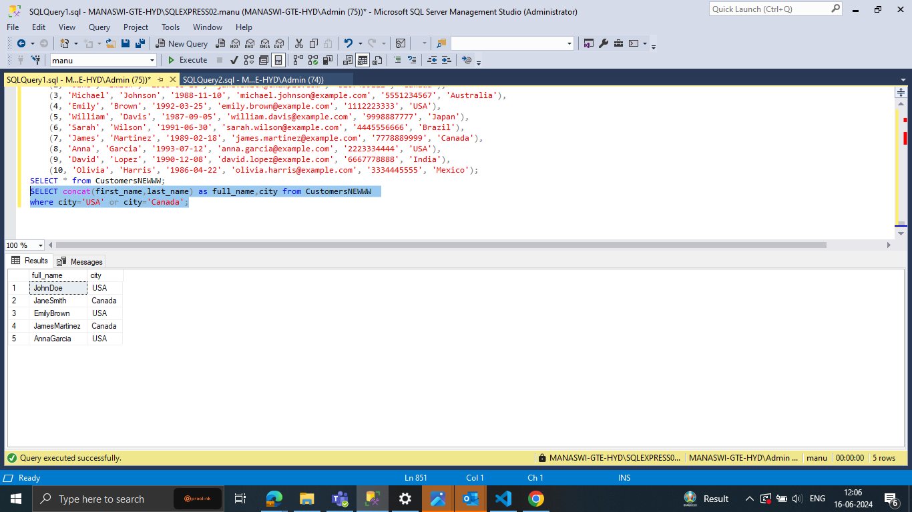

8. Write a SQL query to get the account balance for a specific account.

```sql
select account_id,balance from AccountsNEW1
where account_type='current';
```
 
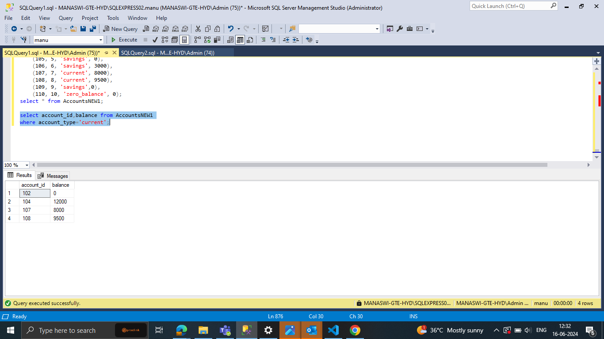 

--------------------------------
9. Write a SQL query to calculate the interest accrued on savings accounts based on a given interest rate.
```sql
select balance * (interest_rate) AS interest_accrued from interestrates INNER JOIN Accounts on interestrates.interest_rate_id=accounts.customer_id
where acctype='savings';
```

10. Write a SQL query to find the average account balance for all customers.
```sql
select avg(balance) as AVGBALANCE from AccountsNEW1;
```

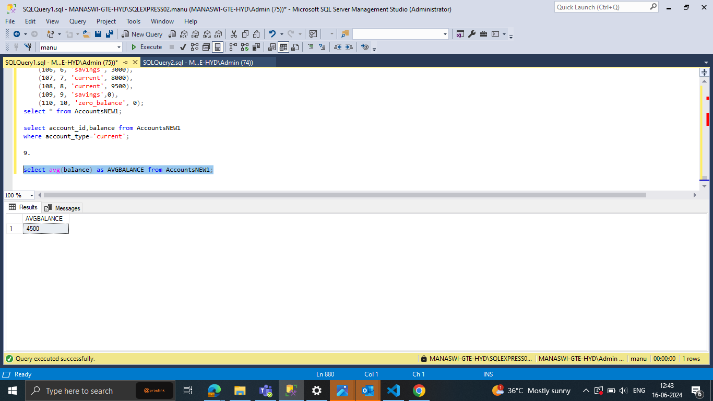

----------------------------------
11. Write a SQL query to calculate the average daily balance for each account over a specified period. 
```sql
SELECT
    account_id,
    AVG(daily_balance) AS average_daily_balance
FROM
    (
        SELECT
            account_id,
            transaction_date,
            SUM(amount) AS daily_balance
        FROM
            Transactions
        WHERE
            transaction_date BETWEEN 'start_date' AND 'end_date' -- Specify your desired period
        GROUP BY
            account_id,
            transaction_date
    ) AS daily_balances
GROUP BY
    account_id;
```


12. Identify accounts with the highest number of transactions ordered by descending order.
```sql
SELECT account_id,COUNT(account_id) AS transaction_count
FROM Transactionsnew
GROUP BY account_id
ORDER BY transaction_count DESC;
```
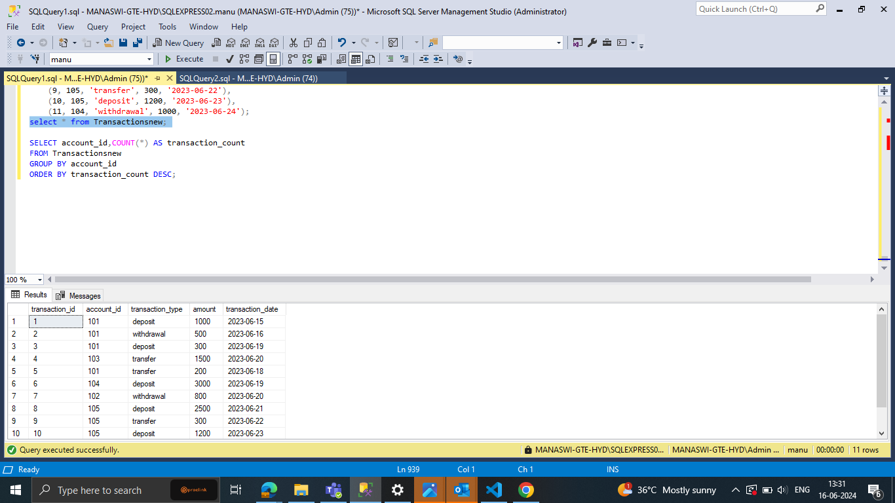
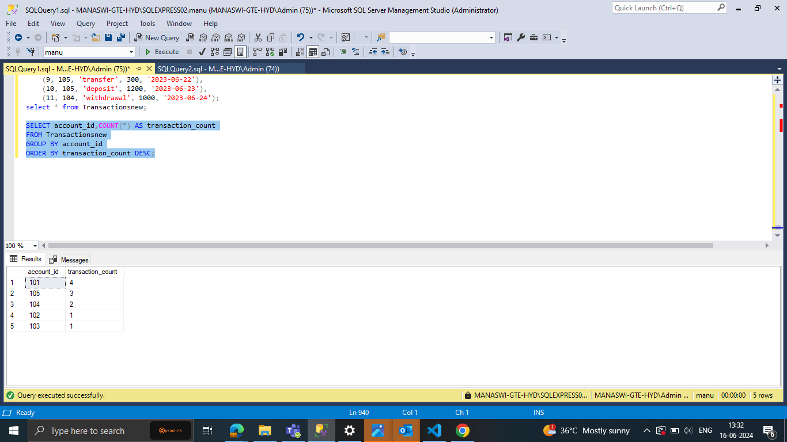
--------------------------------------------
13. List customers with high aggregate account balances, along with their account types.
```sql
SELECT
    C.customer_id,
    C.first_name,
    C.last_name,
    A.account_type,
    SUM(A.balance) AS total_balance
FROM
    Customers C
JOIN
    Accounts A ON C.customer_id = A.customer_id
GROUP BY
    C.customer_id,
    C.first_name,
    C.last_name,
    A.account_type
ORDER BY
    total_balance DESC;

```
14. Identify and list duplicate transactions based on transaction amount, date, and account.

```sql
SELECT account_id,amount,transaction_date,COUNT(*) AS duplicate_count
FROM Transactionsdup
GROUP BY account_id,amount,transaction_date
HAVING COUNT(*) > 1;
```
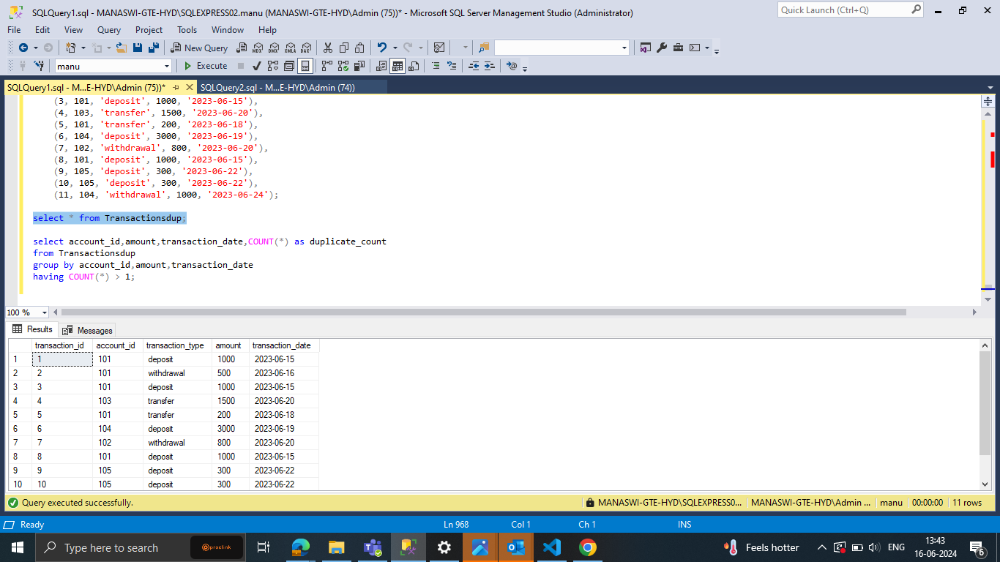
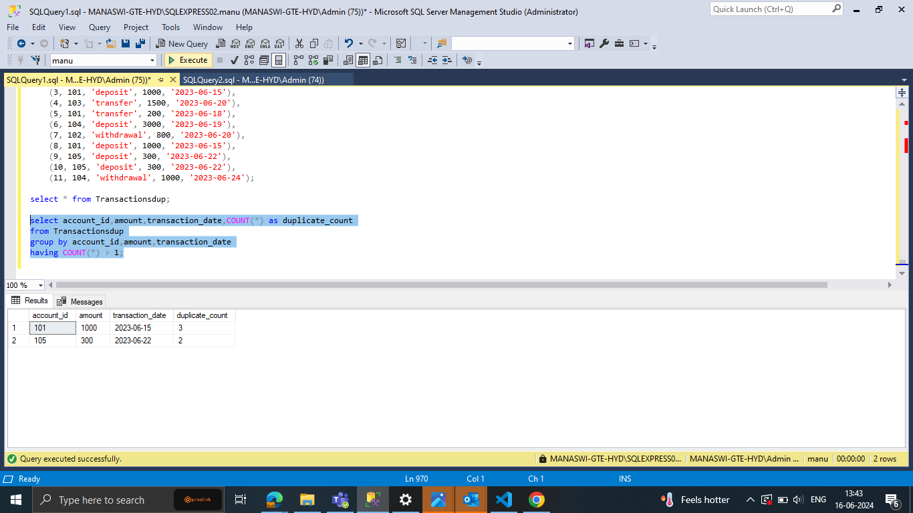

15. Calculate the total balance for each account type, including a subquery within the SELECT clause. 
```sql
select account_type,
(sum(balance)) as total_balance 
from AccountsNEW1 
group by account_type;
```
 
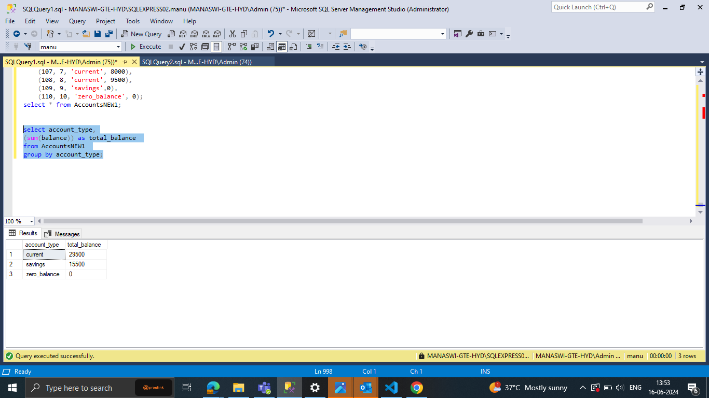


9,11,13